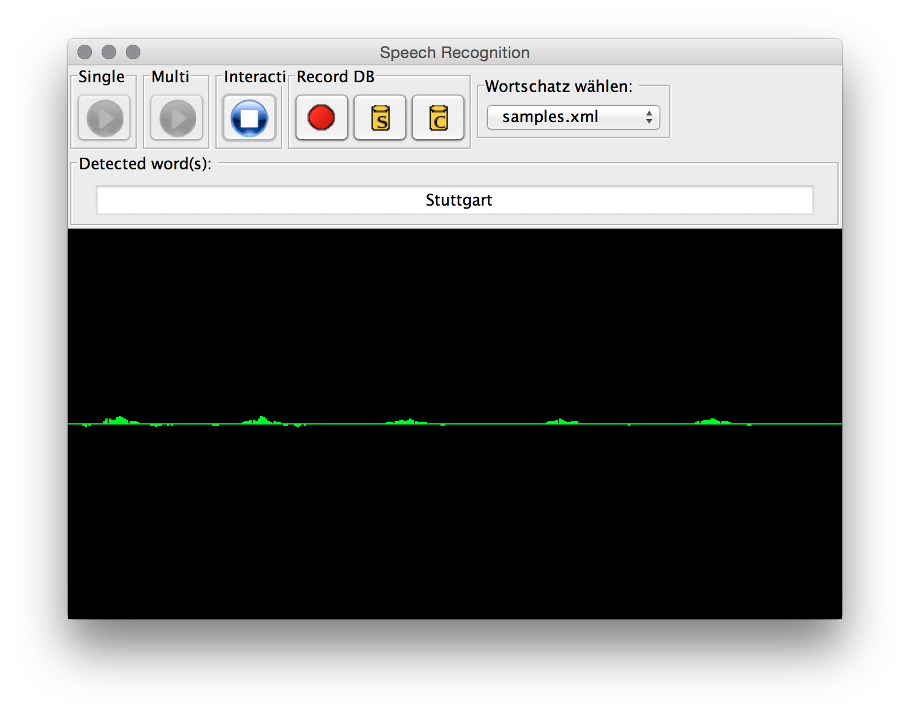
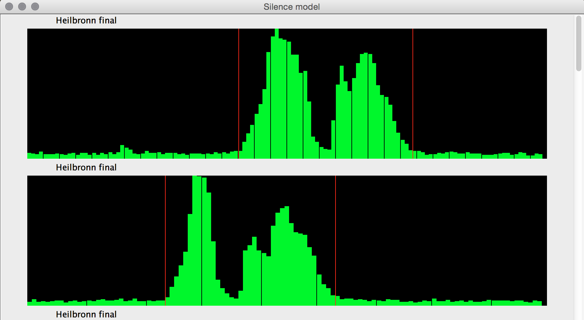

# speech-recog
An old university project on pattern matching, machine learning, speech recognition

Words are recorded using the Java Sound API, preprocessed in various steps and finally the viterbi algorithm is used to learn models on words and to match models against recordings for speech recognition

